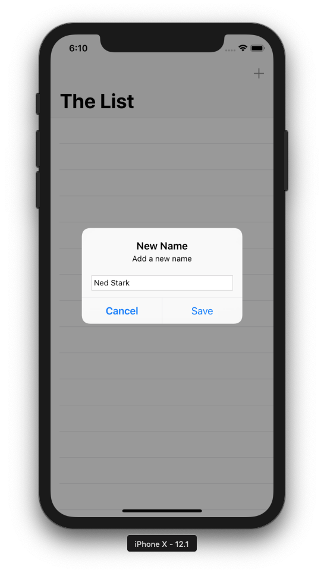
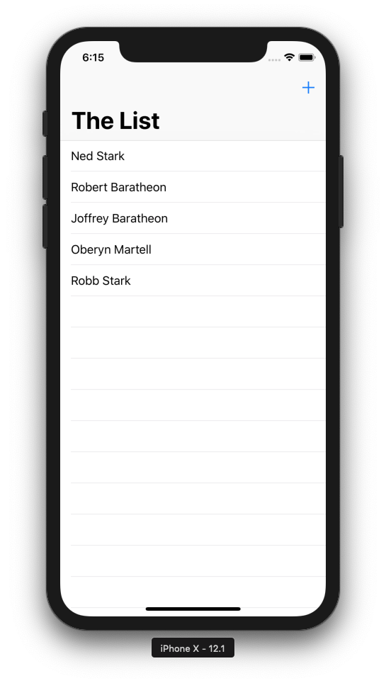

# HitList
From [raywenderlich.com](https://www.raywenderlich.com) : [Getting Started with Core Data Tutorial](https://www.raywenderlich.com/7569-getting-started-with-core-data-tutorial)

The tutorial shows you how to:
* Model data using Xcode's model editor
* Add new records to Core Data
* Fetch a set of records from Core Data
* Display the fetched records using a table view

